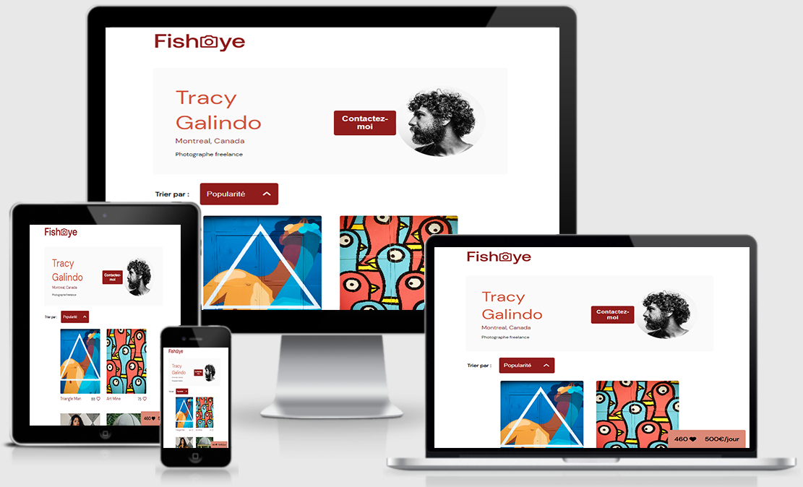

# Projet n°9 : Créer un site accessible pour une plateforme de photographes

## :mag: Aperçu

## :bookmark_tabs: Sommaire
<ol>
    <li><a href="#sujet">Sujet</a></li>
    <li><a href="#demandes_respecter">Demandes à respecter</a></li>
    <li><a href="#objectifs_projet">Objectifs du projet</a></li>
    <li><a href="#technologies_utilisees">Technologies utilisées</a></li>
    <li><a href="#prerequis">Prérequis</a></li>
    <li><a href="#installation">Installation</a></li>
    <li><a href="#utilisation_siteweb">Utilisation du site web</a></li>
    <li><a href="#auteurs_contributeurs">Auteurs et contributeurs</a></li>
    <li><a href="#licence">Licence</a></li>
</ol>

## :page_facing_up: 1. Sujet 

Depuis quelques semaines, vous êtes développeur junior chez Techasite, une société de conseil spécialisée dans le développement de sites web et d'applications mobiles.
Avec votre cheffe de projet Amanda et le Designer UI, vous venez de faire une réunion de lancement du projet avec un nouveau client, FishEye. FishEye est un site web qui permet aux photographes indépendants de présenter leurs meilleurs travaux. Ils ont récemment levé des fonds et aimeraient mettre à jour leur site web.

## :memo: 2. Demandes à respecter 

* Travailler sur un repo GitHub forké ;
* Utiliser des fichiers séparés pour le HTML, le CSS et le JavaScript ;
* Utiliser du JavaScript pur (pas de jQuery) ;
* Commenter son code (décrire chaque fonction et chaque classe, ainsi que les parties du code qui nécessitent plus de détails) ;
* Tester manuellement les fonctionnalités ;
* Le site doit respecter les normes d'accessibilité ;
* L'utilisation de designs patterns est recommandé ;
* Le responsive n'est pas demandé.

## :checkered_flag: 3. Objectifs du projet 

* Approfondir ses connaissances en HTML et CSS.
* Apprendre à utiliser JavaScript tout en respectant les bonnes nomenclatures et pratiques.
* Apprendre à utiliser des designs patterns en JavaScript.
* Gérer des événements JavaScript.

## :computer: 4. Technologies utilisées 

* HTML
* CSS
* JavaScript
* Git & GitHub

## :exclamation: 5. Prérequis 

Aucun

## :wrench: 6. Installation 

Cloner ce repository.

## :question: 7. Utilisation du site web 

- Dans Visual Studio Code, télécharger l'extension "Live server".
- Toujours dans l'éditeur de code, appuyez sur F1, puis appuyez sur "Live Server : Open with Live Server.

## :beers: 8. Auteurs et Contributeurs 

Timoté Lancelle : [GitHub](https://github.com/LancelleTimote) / [LinkedIn](https://www.linkedin.com/in/timote-lancelle-devweb/)

## :page_with_curl: 9. Licence 

Distribué sous la licence MIT. Voir le fichier [LICENSE](LICENSE) pour plus d'informations.